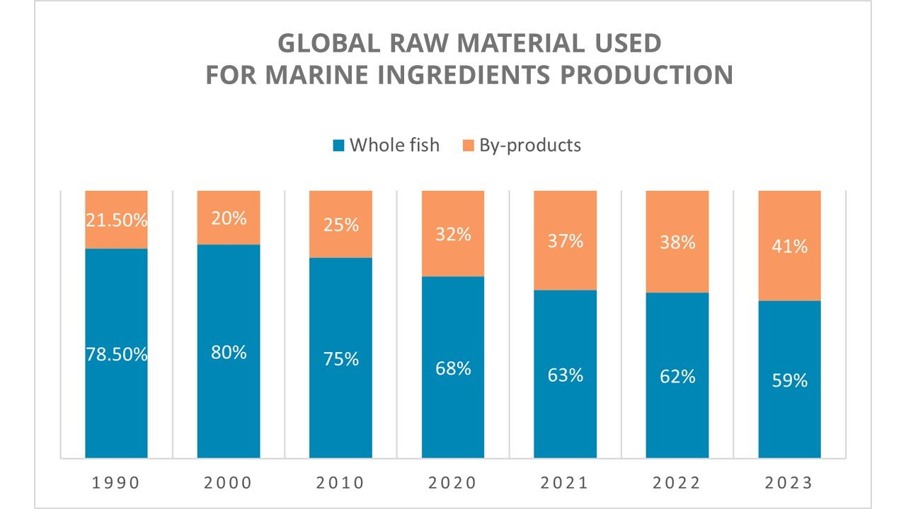

## Summary

ARTIS data for Australia requested and obtained from Jessica Gephart from ARTIS. 

## Setup

```{r setup, include=FALSE}
knitr::opts_chunk$set(echo = TRUE)

library(here)
library(tidyverse)
library(glue)
library(sf)
library(devtools)
library(janitor)

# devtools::install_github("davidsjoberg/ggsankey")
# devtools::install_github("Seafood-Globalization-Lab/exploreARTIS", dependencies = TRUE) # install explore ARTIS package

# library(ggsankey)
# library(exploreARTIS)
# 
# load(here("data/artis_spatial.rda")) # load data that was stored on the exploreArtis github repo; looks like this is spatial information
# 
# load(here("data/mini_artis.rda")) # load data that was stored on the exploreArtis github repo; looks like this is a subset of the artis database!
# 
# load(here("data/mini_consumption.rda")) # looks like this is some consumption info where there is an intermdiate country involved?

artis_aus <- read.csv(here("data/artis_request_clawson.csv"))

```


## Exploration

Ok, so seems like the demo data that ARTIS provides has this information: 

exporter_iso3c (string): Exporter Country ISO 3 code
importer_iso3c (string): Importer Country ISO 3 code
source_country_iso3c (string): Producer Country ISO 3 code
dom_source (string): Domestic Export / Foreign Export / Error Export
hs6 (string): 6-digit HS commodity code
sciname (string): Species or Species group
habitat (string): Marine / Freshwater
method (string): Capture / Aquaculture / Unknown
product_weight_t (double): Product weight (tonnes)
live_weight_t (double): Live weight (tonnes)
hs_version (string): version of HS codes
year (double): Year


HS code for fish meal (tonnage of FM) ----> linked to species type whole fish harvest (live weight)
   - however, it looks like there are some species which could be considered trimmings in this, as a result of error in model allocation

```{r}

View(artis_aus)

# ok so my understanding is that the ARTIS database theoretically has trimmings as part of their fish meal estimates, just not acknowledged/specified as such? Meaning that the total amount of fishmeal reflects the actual total amount of fishmeal produced, they just have only allocate to whole fish like forage fish. For example, if Peru exports fish meal to Norway,  that export volume includes all fish meal exported from Peru (which would theoretically have trimmings in it). If this is the case, then we would likely need to redistribute some proportion of the current traded fish meal to trimmings raw material, based on information of the species it comes from, based on feed company reports and FAO data?

test <- artis_aus %>% 
  mutate(cf = live_weight_t/product_weight_t)

```

  - Ok, so this implies to me that their fishmeal estimates would include the trimmings values. Currently, they are overestimating the amount of fishmeal from whole fish. The total value of fish meal traded won't change, just how much is coming from forage fish vs trimmings fish will change. It is an accounting error. We would need to adjust that whole forage fish value to include the trimmings estimates. 
  
  
  
Summary of potential data prep: 
 - find species used in trimmings and associated fishing areas for those species
     - Add new column **method_2**: specifies if species is trimmings or wild capture or farming
         - capture (e.g., species NOT in trimmings list and specified as capture in ARTIS)
         - capture trimmings (e.g., species IN trimmings list and specified as capture in ARTIS, like Tuna spp)
         - aquaculture trimmings (e.g., specified as aquaculture in ARTIS method column)
         - unknown ; need to decide what to do about these observations for "method".. maybe just assume unless it is an "aquaculture" species specified elsewhere in the database, then it is "capture"? 
      - QUESTION: *Do we only assume trimmings if the species is being sourced from one of the FAO areas that Biomar (and other reports if we can find them) lists for those trimmings spp?*
         
  - Column for possible for trimmings or possible for render; columns **trimmings** and **render**
    - where possible for trimmings == yes and possible for render == no ===> all weight is from trimmings
    - when you have double yes, we have to make decisions about how much to assume from trimmings (based on below info). 
        
 
 - trading flows; access to trimmings and how they are traded and distributed; which source countries create trimmings
   - need to decide if trimmings will be allocated equally globally, or only to places with the best access to emerging markets (like trimmings)
   - Cargill has info on warmwater vs coldwater; so we could apply more trimmings to coldwater places (i.e., countries that produces coldwater species like salmon) since coldwater species use more trimmings in their feeds (~10x more) according to Cargill
   - For example: if there is an importer country that is a "coldwater" country (i.e., produces atlantic salmon), and imports trimmings from a species that could **potentially** be trimmings (see above), then we assume a higher percentage of source biomass imported is from trimmings for that species. Vice versa warmwater country will be lower percentage in the edge cases of "trimmings species". 
          - Could do like a 10 to 1 difference based on the cargill feed types for warm vs cold water spp aquaculture
   

  

Other notes: 
  - conversion factor
  - method (if it is trimmings or whole fish)
  - sciname (any real standouts not included that should be trimmings; if this is the case, may need to adjust some of the raw data; jessica problem )
 - species likely to be trimmings that we can identify (e.g., bluefin tuna, albacore, yellowfin would almost always be trimmings if that FM)
 

  
## Current knowledge 

 > Although an estimated 27% of fishmeal is derived from processing by-products, the species, geographical, and temporal variation in that estimate is currently unknown. Consequently, fishmeal is currently treated as sourced from whole fish reduction. This does not affect the total trade or trade patterns of fishmeal but does result in an overestimate of the proportion of production going to fishmeal in cases where byproducts are used.
 
  
How has the % of trimmings included in FMFO changed over the years? This will be important if we hope to resolve this temporally. 
 - IFFO report: https://www.iffo.com/product
  - "the share of capture fisheries that was utilised for direct human consumption in 2018 was roughly 74 million tonnes and around 14million tonnes of the remaining capture fish was used as raw material to produce marine ingredients."
 


```{r}

years <- c(1990, 1990, 2000, 2000, 2010, 2010, 2020, 2020, 2021, 2021, 2022, 2022, 2023, 2023)
type <- rep(c("Whole fish", "By-products"), 7)
percentage <- c(78.5, 21.5, 80, 20, 75, 25, 68, 32, 63, 37, 62, 38, 59, 41)

# Combine into a dataframe
trimmings_over_time <- data.frame(years, type, percentage)
## ok so this is for all marine ingredients. Can we disaggregate this to fish meal vs fish oil? 


## The IFFO report has this information for 2023:

years <- 2023
type <- c("Whole fish", "By-products")
ingredient <- c("fishmeal", "fish oil")

fmfo_2023 <- expand.grid(year = years, type = type, ingredient = ingredient) %>%
  mutate(percentage = case_when(
    type == "Whole fish" & ingredient == "fishmeal" ~ 62.3, 
    type == "By-products" & ingredient == "fishmeal" ~ 37.7,
    type == "Whole fish" & ingredient == "fish oil" ~ 45.5, 
    type == "By-products" & ingredient == "fish oil" ~ 54.5, 
  )) ## if we wanted to extrapolate this to previous years, we could use the trends from the total raw material data above? 


# the iffo report also has the byproducts broken down by spp for fishmeal and oil

## lets try to figure out how they got this info
```

Biomar trimmings species reported


```{r}

```


https://www.iffo.com/sources-marine-ingredients-whole-fish-products

Industrial-grade forage fish: Sandeels (Ammodytes spp.), Gulf menhaden (Brevoortia patronus), Atlantic menhaden (B. tyrannus), Norway pout (Trisopterus esmarkii).

Food-grade forage fish: Anchoveta (Engraulis ringens), Japanese anchovy (E. japonicus), European anchovy (E. encrasicolus), Sardinellas (Sardinella spp.), Capelin (Mallotus villosus), Blue whiting (Micromesistius poutassou), European sprat (Sprattus sprattus).

Food-fish: Chilean jack mackerel (Trachurus murphyi), Chub mackerel (Scomber japonicus), Japanese jack mackerel (T. japonicus), South American pilchard (Sardinops sagax), Pacific herring (Clupea pallasii pallasii), Indian mackerel (Rastrelliger kanagurta), Atlantic herring (C. harengus), Cape horse mackerel (T. capensis), European pilchard (Sardina pilchardus).


http://www.fao.org/3/i2734e/i2734e.pdf
One key point in the discussion of this paper is the text that reads: “In respect of “food grade forage fish”, it does not seem as if the fishmeal industry is withdrawing fish that food fish markets could have absorbed. The reverse seems to be the case: fishmeal plants make use of fish that the fresh fish market and the fish processing industries cannot absorb. This is definitely the case for the 8–10 million tonnes of fish that are processed yearly into fishmeal in Peru and Chile. It also seems likely to be the case for several of the “food-grade forage species” caught elsewhere.” 

 - in laymans terms: Fish that could be consumed by humans aren't really used for FMFO. 
 
  - Seems like they get all of their information from a article in this magazine edition, but have no references to datasets used. It must be in-house IFFO datasets they are using: https://issuu.com/aquafeed.com/docs/aquafeed_vol_13_issue_4_october_2021 
 
 
SOFIA 2024:

 > "Of the 185.4 million tonnes (live weight equivalent) of aquatic animals harvested globally in 2022, about 89 percent (164.6 million tonnes) was used for direct human consumption. The remaining 11 percent (20.8 million tonnes) was destined for non-food purposes, of which about 83 percent (17 million tonnes) was reduced to fishmeal and fish oil, while the rest (about 4 million tonnes) was largely utilized as ornamental fish, in aquaculture  (e.g. as fry, fingerlings or small adults for ongrowing), as bait, in pharmaceutical applications, for pet food, or as raw material for direct feeding in aquaculture and for the raising of livestock and fur animals." 
 
   - This suggests 17 million tonnes of trimmings? 
   - A portion of the remaining 4 million tonnes are recycled to fish farms for feed 
   

 - They source food balance sheets for non-food use of aquatic animals.
 - They source the IFFO report for the by-product stuff... 
 
 
 
Potential references: 
 
 A SWOT Analysis of the Use of Marine, Grain, Terrestrial-Animal and Novel Protein Ingredients in Aquaculture Feeds: https://www.tandfonline.com/doi/full/10.1080/23308249.2024.2315049

 
 Project to model the use of fisheries by-products in the production of marine ingredients with special reference to omega-3 fatty acids EPA and DHA: https://www.iffo.com/system/files/downloads/Report%20IoA%20IFFO%20project%20Final_0.pdf
 
 - Reference "IFFO data and literature" in the report, so they probably get a lot of data from internal IFFO data and members like Jessica said. 
 - Guessing they use this model for the IFFO blog listed above. 
 

Notes: 
 - We have estimated biomass of FM. Do we make our estimates on just FM so that FO could potentially be added in the future. However, this would substantially underestimate(?) live weight for FM reported (compared to what Jessica currently has). 


```{r}
fao_fish <- read.csv(file.path("/mnt/rdsi/raw_data/fao/FAO_fishstat_2020/global_capture_production_1950-2020.csv")) %>%
  clean_names()

test <- fao_fish %>%
  filter(country_name == "Peru") %>%
  distinct(country_name, asfis_species_name, asfis_species_name_1, fao_major_fishing_area_code, fao_major_fishing_area_name, unit_name)

test2 <- fao_fish %>%
    filter(fao_major_fishing_area_code == 27 | fao_major_fishing_area_code == 34 | fao_major_fishing_area_code == 37 | fao_major_fishing_area_code == 87) %>%
  filter(str_detect(asfis_species_name_1, "Sardine|sardine")) %>%
  filter(str_detect(asfis_species_name, "Sardine|sardine")) %>%
  filter(asfis_species_name != "Pacific sardine") %>%
  filter(x_2015 >0 |x_2016 >0 |x_2017 >0 |x_2018 >0 |x_2019 >0 |x_2020 >0 ) %>%
    distinct(country_name, asfis_species_name, asfis_species_name_1, fao_major_fishing_area_code, fao_major_fishing_area_name, unit_name) %>%
    dplyr::select(asfis_species_name, fao_major_fishing_area_code, country_name)


## biomar tunas

test2 <- fao_fish %>%
    filter(fao_major_fishing_area_code == 87 | fao_major_fishing_area_code == 57) %>%
  filter(str_detect(asfis_species_name_1, "Tunas, bonitos, billfishes")) %>%
  filter(x_2015 >0 |x_2016 >0 |x_2017 >0 |x_2018 >0 |x_2019 >0 |x_2020 >0 ) %>%
    distinct(country_name, asfis_species_name, asfis_species_name_1, fao_major_fishing_area_code, fao_major_fishing_area_name, unit_name) %>% 
  filter(asfis_species_name %in% c("Albacore", "Bigeye tuna", "Longtail tuna", "Skipjack tuna", "Southern bluefin tuna", "Tuna-like fishes nei", "Yellowfin tuna", "Dogtooth tuna", "Atlantic bluefin tuna", "Tunas nei")) %>% ## excluding any species that could also be "mackerel" as biomar has a diff specification for these
  dplyr::select(asfis_species_name, fao_major_fishing_area_code, country_name)

  

## biomar Pacific Mackerel Spp. 87, 77, 71

test2 <- fao_fish %>%
    filter(fao_major_fishing_area_code == 87 | fao_major_fishing_area_code == 77 | fao_major_fishing_area_code == 71) %>%
  filter(str_detect(asfis_species_name, "Mackerel|mackerel")) %>%
  filter(x_2015 >0 |x_2016 >0 |x_2017 >0 |x_2018 >0 |x_2019 >0 |x_2020 >0 ) %>%
    distinct(country_name, asfis_species_name, asfis_species_name_1, fao_major_fishing_area_code, fao_major_fishing_area_name, unit_name) %>% 
  dplyr::select(asfis_species_name, fao_major_fishing_area_code, country_name)


## biomar Atlantic Mackerel Spp. 27, 34

test2 <- fao_fish %>%
    filter(fao_major_fishing_area_code == 27 | fao_major_fishing_area_code == 34) %>%
  filter(str_detect(asfis_species_name, "Mackerel|mackerel")) %>%
  filter(x_2015 >0 |x_2016 >0 |x_2017 >0 |x_2018 >0 |x_2019 >0 |x_2020 >0 ) %>%
    distinct(country_name, asfis_species_name, asfis_species_name_1, fao_major_fishing_area_code, fao_major_fishing_area_name, unit_name) %>% 
  dplyr::select(asfis_species_name, fao_major_fishing_area_code, country_name)

## biomar Antarctic Krill 48

test2 <- fao_fish %>%
    filter(fao_major_fishing_area_code == 48) %>%
  filter(str_detect(asfis_species_name, "Krill|krill")) %>%
  filter(x_2015 >0 |x_2016 >0 |x_2017 >0 |x_2018 >0 |x_2019 >0 |x_2020 >0 ) %>%
    distinct(country_name, asfis_species_name, asfis_species_name_1, fao_major_fishing_area_code, fao_major_fishing_area_name, unit_name) %>% 
  dplyr::select(asfis_species_name, fao_major_fishing_area_code, country_name)


## biomar Anchovy 47, 77, 37, 27, 34, 87, 61

test2 <- fao_fish %>%
    filter(fao_major_fishing_area_code == 47 | fao_major_fishing_area_code == 77 | fao_major_fishing_area_code == 37| fao_major_fishing_area_code == 27 | fao_major_fishing_area_code == 34 | fao_major_fishing_area_code == 87| fao_major_fishing_area_code == 61) %>%
  filter(str_detect(asfis_species_name, "Anchovy|anchovy")) %>%
  filter(x_2015 >0 |x_2016 >0 |x_2017 >0 |x_2018 >0 |x_2019 >0 |x_2020 >0 ) %>%
    distinct(country_name, asfis_species_name, asfis_species_name_1, fao_major_fishing_area_code, fao_major_fishing_area_name, unit_name) %>% 
  dplyr::select(asfis_species_name, fao_major_fishing_area_code, country_name) %>%
  filter(asfis_species_name != "Anchoveta(=Peruvian anchovy)") # filter this out since we already did this for biomar

## biomar Atlatic Cod 27

test2 <- fao_fish %>%
    filter(fao_major_fishing_area_code == 27) %>%
  filter(str_detect(asfis_species_name, "Atlantic cod|Atlantic Cod")) %>%
  filter(x_2015 >0 |x_2016 >0 |x_2017 >0 |x_2018 >0 |x_2019 >0 |x_2020 >0 ) %>%
    distinct(country_name, asfis_species_name, asfis_species_name_1, fao_major_fishing_area_code, fao_major_fishing_area_name, unit_name) %>% 
  dplyr::select(asfis_species_name, fao_major_fishing_area_code, country_name) %>%
  filter(asfis_species_name != "North Atlantic codling")

## biomar Araucanian Herring 87

test2 <- fao_fish %>%
    filter(fao_major_fishing_area_code == 87) %>%
  filter(str_detect(asfis_species_name, "Araucanian herring")) %>%
  filter(x_2015 >0 |x_2016 >0 |x_2017 >0 |x_2018 >0 |x_2019 >0 |x_2020 >0 ) %>%
    distinct(country_name, asfis_species_name, asfis_species_name_1, fao_major_fishing_area_code, fao_major_fishing_area_name, unit_name) %>% 
  dplyr::select(asfis_species_name, fao_major_fishing_area_code, country_name)


## biomar Sardine 51

test2 <- fao_fish %>%
    filter(fao_major_fishing_area_code == 51) %>%
  filter(str_detect(asfis_species_name, "Sardine|sardine")) %>%
  filter(x_2015 >0 |x_2016 >0 |x_2017 >0 |x_2018 >0 |x_2019 >0 |x_2020 >0 ) %>%
    distinct(country_name, asfis_species_name, asfis_species_name_1, fao_major_fishing_area_code, fao_major_fishing_area_name, unit_name) %>% 
  dplyr::select(asfis_species_name, fao_major_fishing_area_code, country_name) %>%
  filter(asfis_species_name != "Pacific sardine") ## bc this is already in biomar elsewhere


## biomar Sprat 27  

test2 <- fao_fish %>%
    filter(fao_major_fishing_area_code == 27) %>%
  filter(str_detect(asfis_species_name, "Sprat|sprat")) %>%
  filter(x_2015 >0 |x_2016 >0 |x_2017 >0 |x_2018 >0 |x_2019 >0 |x_2020 >0 ) %>%
    distinct(country_name, asfis_species_name, asfis_species_name_1, fao_major_fishing_area_code, fao_major_fishing_area_name, unit_name) %>% 
  dplyr::select(asfis_species_name, fao_major_fishing_area_code, country_name)

## biomar Alaska Pollock 67

test2 <- fao_fish %>%
    filter(fao_major_fishing_area_code == 67) %>%
  filter(str_detect(asfis_species_name, "pollock|Pollock")) %>%
  filter(x_2015 >0 |x_2016 >0 |x_2017 >0 |x_2018 >0 |x_2019 >0 |x_2020 >0 ) %>%
    distinct(country_name, asfis_species_name, asfis_species_name_1, fao_major_fishing_area_code, fao_major_fishing_area_name, unit_name) %>% 
  dplyr::select(asfis_species_name, fao_major_fishing_area_code, country_name)

## biomar Pacific Sardine 77, 81, 61, 87

test2 <- fao_fish %>%
    filter(fao_major_fishing_area_code == 77 | fao_major_fishing_area_code == 81 | fao_major_fishing_area_code == 61 | fao_major_fishing_area_code == 87) %>%
  filter(str_detect(asfis_species_name, "Pacific sardine")) %>%
  filter(x_2015 >0 |x_2016 >0 |x_2017 >0 |x_2018 >0 |x_2019 >0 |x_2020 >0 ) %>%
    distinct(country_name, asfis_species_name, asfis_species_name_1, fao_major_fishing_area_code, fao_major_fishing_area_name, unit_name) %>% 
  dplyr::select(asfis_species_name, fao_major_fishing_area_code, country_name)


## biomar Sandeel 27

test2 <- fao_fish %>%
    filter(fao_major_fishing_area_code == 27) %>%
  filter(str_detect(asfis_species_name, "Sandeel")) %>%
  filter(x_2015 >0 |x_2016 >0 |x_2017 >0 |x_2018 >0 |x_2019 >0 |x_2020 >0 ) %>%
    distinct(country_name, asfis_species_name, asfis_species_name_1, fao_major_fishing_area_code, fao_major_fishing_area_name, unit_name) %>% 
  dplyr::select(asfis_species_name, fao_major_fishing_area_code, country_name)


## biomar Sardinella 34, 37

test2 <- fao_fish %>%
    filter(fao_major_fishing_area_code == 34 | fao_major_fishing_area_code == 37) %>%
  filter(str_detect(asfis_species_name, "Sardinella|sardinella")) %>%
  filter(x_2015 >0 |x_2016 >0 |x_2017 >0 |x_2018 >0 |x_2019 >0 |x_2020 >0 ) %>%
    distinct(country_name, asfis_species_name, asfis_species_name_1, fao_major_fishing_area_code, fao_major_fishing_area_name, unit_name) %>% 
  dplyr::select(asfis_species_name, fao_major_fishing_area_code, country_name)

## biomar Menhaden	87, 61

test2 <- fao_fish %>%
    filter(fao_major_fishing_area_code == 87 | fao_major_fishing_area_code == 61) %>%
  filter(str_detect(asfis_species_name, "Menhaden|menhaden")) %>%
  filter(x_2015 >0 |x_2016 >0 |x_2017 >0 |x_2018 >0 |x_2019 >0 |x_2020 >0 ) %>%
    distinct(country_name, asfis_species_name, asfis_species_name_1, fao_major_fishing_area_code, fao_major_fishing_area_name, unit_name) %>% 
  dplyr::select(asfis_species_name, fao_major_fishing_area_code, country_name)


```


Farmed seafood byproducts

Assume it is only Atlantic salmon, use only countries with FAO areas 87 and 27 based on Biomar

 - not sure if this is even necessary, as we could just consider all atlantic salmon FM in artis to be trimmings but i'll do it anyways

```{r}

## read in aquaculture data from fao fishstat

fao_aqua <- read.csv("/mnt/rdsi/raw_data/fao/FAO_fishstat_2020/global_aquaculture_production_1950_2020.csv") %>%
  clean_names()

test2 <- fao_aqua %>%
    filter(fao_major_fishing_area_code == 87 | fao_major_fishing_area_code == 27) %>%
  filter(str_detect(asfis_species_name, "Atlantic salmon")) %>%
  filter(x_2015 >0 |x_2016 >0 |x_2017 >0 |x_2018 >0 |x_2019 >0 |x_2020 >0 ) %>%
    distinct(country_name, asfis_species_name, asfis_species_name_1, fao_major_fishing_area_code, fao_major_fishing_area_name, unit_name) %>% 
  dplyr::select(asfis_species_name, fao_major_fishing_area_code, country_name)


```

